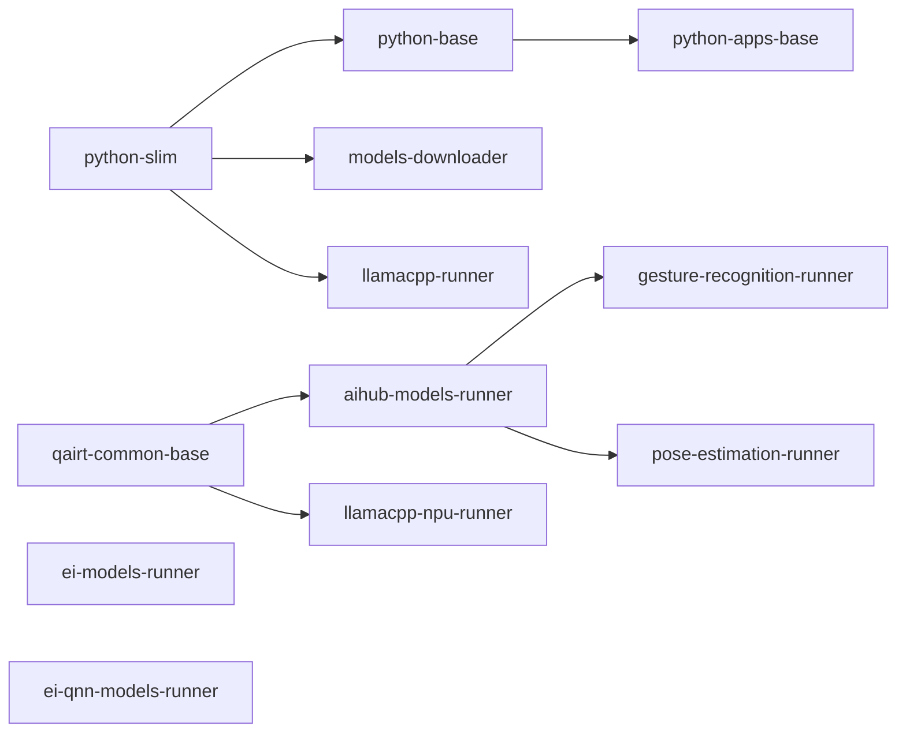

# Containers

Every container image produced by this repo lives here, one directory per image.

## Layout

```
containers/
├── base/     shared base images — never released on their own
├── ai/       AI/ML model runners
└── bricks/   the library itself and its supporting tooling
```

The sub-folder is the **release unit**: a tag's prefix selects the folder to release, so which images a
tag ships is decided by the layout alone (see [Release process](#release-process)).

Apart from that, the group is not part of a container's identity. A container is always referred to by
its **leaf directory name**, which is also its image name — `ghcr.io/arduino/app-bricks/<name>` — and
the value used in `downstream`, in the CI build matrices and in the `containers` input of the dev
workflow. CI finds a container by globbing `containers/*/<name>/ci.json`, so names must be unique across
groups; the build planner fails if two groups declare the same one.

## Inventory

| Container | Group | Built `FROM` | Purpose |
|---|---|---|---|
| `python-slim` | base | `python:3.13-slim-trixie` | Minimal Python layer shared by everything else |
| `python-base` | base | `python-slim` | System deps, non-root user, fonts, OpenCV wheel, libcamera + GStreamer packages |
| `qairt-common-base` | base | `python:3.13-slim-trixie` | Qualcomm AI Runtime and FastRPC libraries shared by the NPU runners |
| `python-apps-base` | bricks | `python-base` | App runtime: installs the Arduino App Bricks `.whl` and the Streamlit config |
| `models-downloader` | bricks | `python-slim` | Downloads models from AI Hub, Edge Impulse and Hugging Face per `models/models-list.yaml` |
| `aihub-models-runner` | ai | `qairt-common-base` | Runs Qualcomm AI Hub models, with GStreamer/WebSocket input and MJPEG/WebSocket output |
| `gesture-recognition-runner` | ai | `aihub-models-runner` | Hand-gesture recognition on the MediaPipe palm/landmark/classifier models |
| `pose-estimation-runner` | ai | `aihub-models-runner` | Body pose estimation on the PoseNet MobileNet model, 17 keypoints per person, custom pose models supported |
| `ei-models-runner` | ai | Edge Impulse inference image | Edge Impulse inference with the bundled out-of-the-box models |
| `ei-qnn-models-runner` | ai | Edge Impulse QNN inference image | Same, on the NPU-accelerated (QNN) models |
| `llamacpp-runner` | ai | `python-slim` | llama.cpp model router, CPU build |
| `llamacpp-npu-runner` | ai | `qairt-common-base` | llama.cpp model router, Hexagon NPU build |



`ei-models-runner` and `ei-qnn-models-runner` build on external Edge Impulse images and have no upstream
inside this repo.

## Anatomy of a container directory

| Path | Required | Description |
|---|---|---|
| `Dockerfile` | yes | Build recipe. The directory itself is the build context. |
| `ci.json` | yes | CI metadata: watched paths, build args, dependencies, release flags |
| `pyproject.toml` + `uv.lock` | if Python packages are installed | The Python packages the image installs, declared in `pyproject.toml` and pinned with hashes in `uv.lock` by `task deps:lock`. The Dockerfile installs from the lock. Never install packages inline, the [dependency license scan](../scripts/licensed/README.md) only sees the lock |

SBOMs are not kept in the tree: they are generated from the published images at release time (see
[SBOMs](#sboms)) and by the dev workflow as run artifacts.

An image that derives from another container in this repo must declare `ARG REGISTRY` and
`ARG BASE_IMAGE_VERSION` and use them in its `FROM`, so CI can point it at the freshly built upstream
instead of `latest`. Its parent must list it in `downstream`, and its own `sbom.runtime_base` must match
its `FROM`.

Note there is no `tag_prefix` in `ci.json` — the directory decides which tag releases the image. See the
[ci.json reference](../.github/README.md#cijson-reference) for every field.

## Release process

The tag prefix is the folder to release:

| Tag | Releases | Extra |
|---|---|---|
| `ai/X.Y.Z` | everything in `containers/ai/` | Opens a PR updating the compose files that reference the runners |
| `bricks/X.Y.Z` | everything in `containers/bricks/` | Builds the Python `.whl` and attaches it, plus the SBOMs of every distributed image, to the GitHub Release |

Pushing the tag runs `docker-publish.yml`, which:

1. **Resolves the build set** — the tagged folder, plus everything that derives from it, plus every base
   image any of those need. Base images in `containers/base/` are therefore built and tagged with the
   release version, but tagging the `base` group alone releases nothing.
2. **Orders it into waves** — `level_0` are the images with no dependency being built in the same run,
   each later wave builds on the previous one. So `bricks/X.Y.Z` builds `python-slim`, then
   `python-base` and `models-downloader`, then `python-apps-base`.
3. **Skips what has not changed** — for `level_0` only, if a container's `watch_paths` are untouched
   since the previous tag of its own group, the existing image is re-tagged with `crane copy` instead of
   rebuilt. Later waves always rebuild, since their base was just rebuilt.
4. **Publishes** to `ghcr.io/arduino/app-bricks/<name>:X.Y.Z`, adding `:latest` for the containers that
   set `tag_latest`.

A tag whose prefix is not an existing folder fails the run with the list of valid groups.

## SBOMs

The `bricks/X.Y.Z` release attaches `sboms.zip` to the GitHub Release, covering **every image we
distribute**: the containers built by that release at `X.Y.Z`, plus the runners of the other groups at
the version the compose files under `src/` pin them to, plus the base images of both sets. The set is
resolved by `scripts/distributed_images.py` from `ci.json` and the compose files, and each image is
scanned with `scripts/sbom_delta.py` against the base image it was built from (`sbom.runtime_base`).
Each wave is scanned as soon as it is pushed, while the next wave builds; the pinned images are scanned
from the start. The archive holds one `<name>-<version>/` folder per image with `base`, `full` and
`delta` SPDX documents. A failed scan never blocks the release: the image is reported as a warning and
listed in `MISSING.txt` inside the archive.

Since the compose references are what ties an ai release to the library, release `ai/*` first, merge
the bot PRs that bump those references, then release `bricks/*`.

> `bricks/*` replaced `release/*` as the library release prefix when the containers were grouped by
> folder. Older `release/*` tags remain readable by `setuptools_scm` but no longer trigger a release.

## Development builds

`docker-build.yml` is manual (`workflow_dispatch`): pick a branch, and either `all` or a comma-separated
list of container names. The same dependency resolution applies — selecting a leaf pulls in its bases,
selecting a base pulls in everything derived from it — and images are published as
`ghcr.io/arduino/app-bricks/<name>:dev-<branch>`. They are deleted automatically when the branch is.

Full CI documentation: [`.github/README.md`](../.github/README.md).
